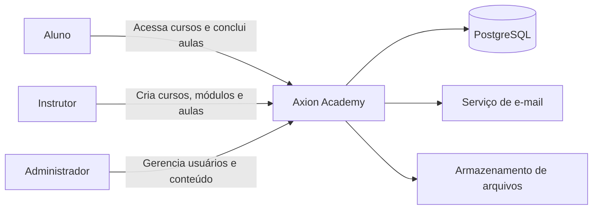
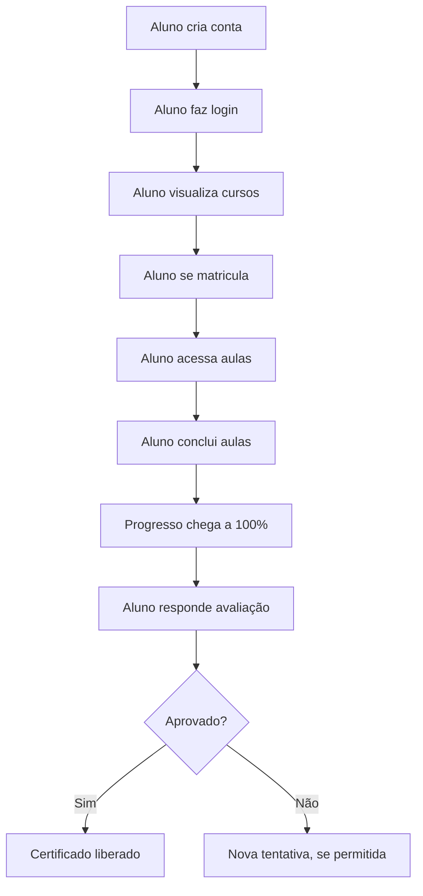
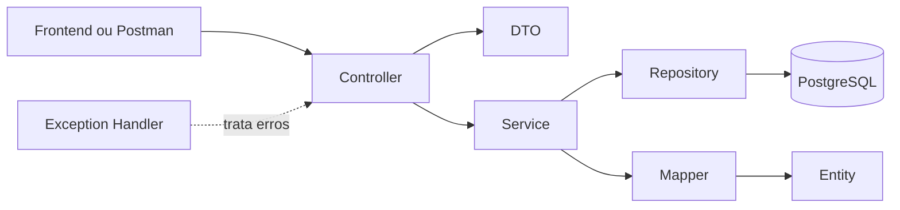
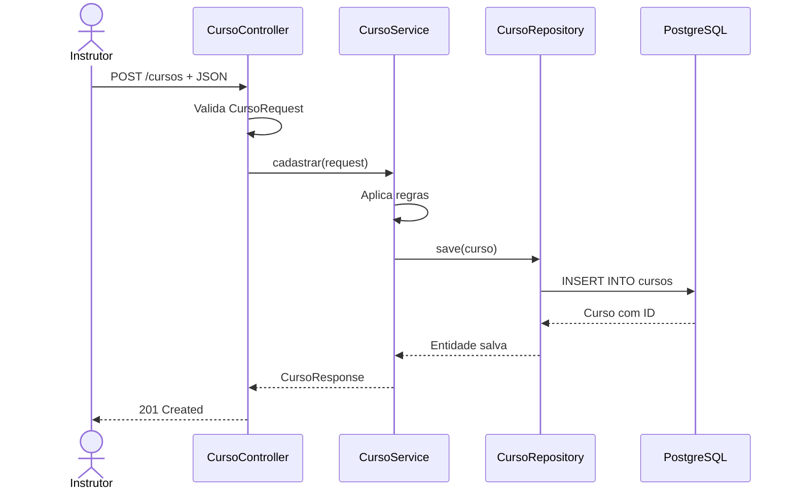
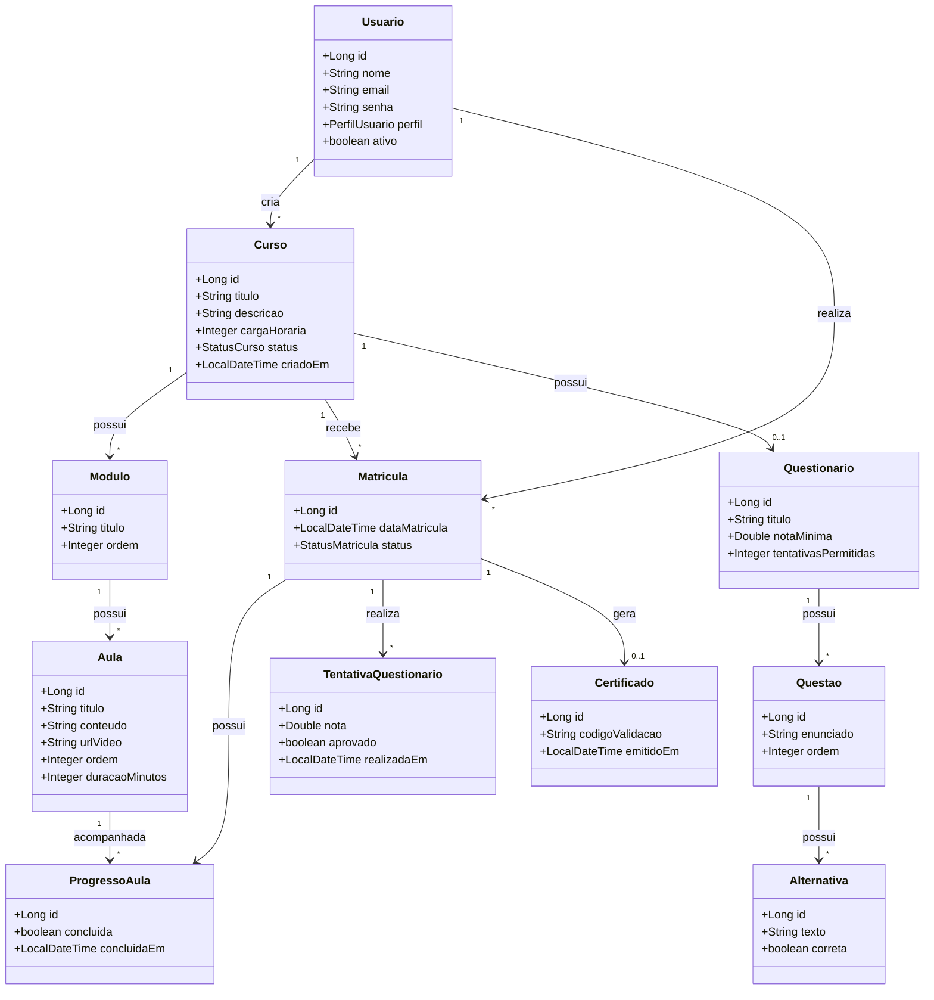
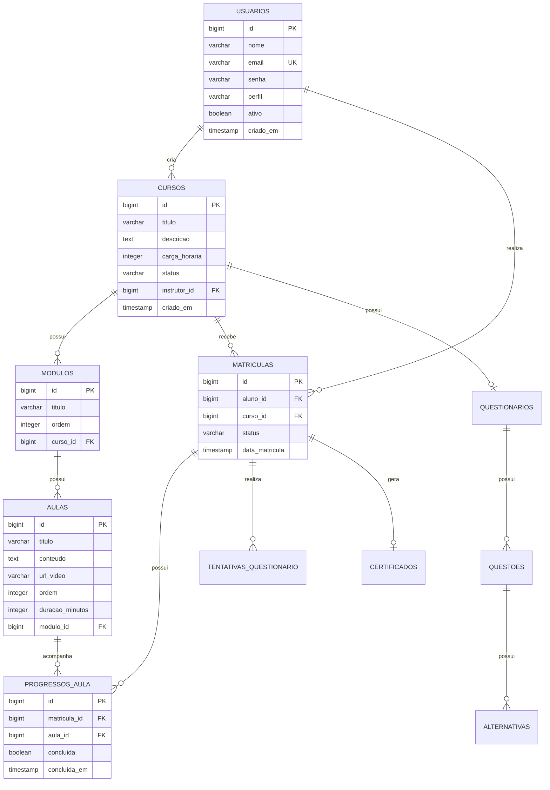
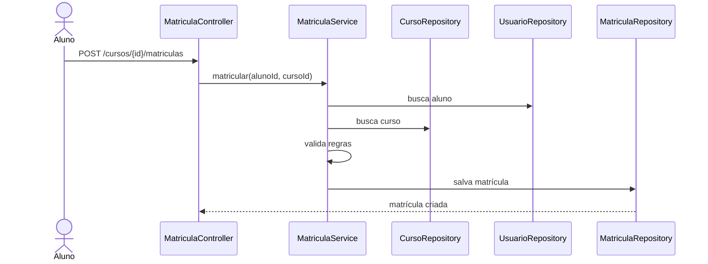
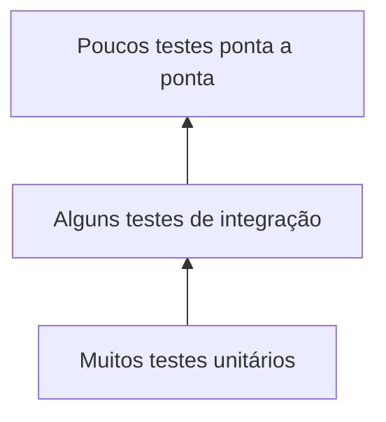

# Axion Academy — Documentação completa do projeto

> Plataforma de cursos da Liga Acadêmica Axion, desenvolvida com Java e Spring Boot.

Esta documentação foi criada para servir como um **mapa de construção manual**. Ela não entrega um sistema pronto para copiar. Ela explica:

- o que construir;
- em qual ordem;
- por que cada classe existe;
- como as partes se comunicam;
- quais regras precisam ser implementadas;
- como testar cada etapa;
- quais conceitos de Java e Spring aparecem no projeto.

---

# 1. Objetivo do projeto

A Axion Academy será uma plataforma em que:

- administradores gerenciam a plataforma;
- instrutores criam cursos;
- cursos são divididos em módulos;
- módulos possuem aulas;
- alunos se matriculam;
- alunos acompanham o próprio progresso;
- questionários podem ser aplicados;
- certificados podem ser emitidos.

## 1.1 Regra principal de desenvolvimento

Não construa tudo ao mesmo tempo.

Use esta ordem:

```text
Curso
→ Módulo
→ Aula
→ Usuário
→ Matrícula
→ Progresso
→ Segurança
→ Questionários
→ Certificados
→ Relatórios
```

Só avance quando a etapa atual estiver funcionando e você conseguir explicar o que fez.

## 1.2 Primeira versão útil

A primeira versão precisa permitir:

- cadastrar curso;
- criar módulos;
- criar aulas;
- publicar curso;
- cadastrar aluno;
- matricular aluno;
- marcar aula como concluída;
- calcular progresso.

Não entram na primeira versão:

- pagamento;
- chat;
- fórum;
- ranking;
- gamificação;
- aplicativo mobile;
- microserviços;
- hospedagem própria de vídeo.

---

# 2. Tecnologias

## 2.1 Base

- Java 21
- Spring Boot
- Maven
- Spring Web
- Spring Data JPA
- Bean Validation
- PostgreSQL
- Flyway
- Git e GitHub
- Postman ou Insomnia

## 2.2 Depois

- Spring Security
- JWT ou sessão
- JUnit
- Mockito
- Swagger/OpenAPI
- Docker
- CI/CD

## 2.3 Dependências iniciais do Spring Initializr

```text
Spring Web
Spring Data JPA
Validation
PostgreSQL Driver
Flyway Migration
Spring Boot DevTools
```

Não adicione Spring Security no primeiro dia.

---

# 3. Problema e solução

## 3.1 Problema

Sem uma plataforma central, o conteúdo da Liga pode ficar espalhado em:

- grupos;
- links;
- vídeos;
- documentos;
- formulários;
- pastas;
- mensagens.

## 3.2 Solução

A Axion Academy centraliza:

```text
Curso
└── Módulo
    └── Aula
```

E acompanha:

```text
Aluno
└── Matrícula
    └── Progresso
```

---

# 4. Perfis de usuário

## Aluno

Pode:

- criar conta;
- fazer login;
- visualizar cursos;
- matricular-se;
- acessar aulas;
- concluir aulas;
- responder questionários;
- receber certificado.

## Instrutor

Pode:

- criar cursos;
- editar os próprios cursos;
- criar módulos;
- criar aulas;
- publicar conteúdos;
- acompanhar alunos matriculados;
- criar questionários.

## Administrador

Pode:

- gerenciar usuários;
- alterar perfis;
- aprovar ou ocultar cursos;
- gerenciar categorias;
- visualizar relatórios;
- administrar toda a plataforma.

---

# 5. Diagrama de contexto



## Leitura simples

- usuários enviam requisições;
- a aplicação processa regras;
- os dados são salvos no PostgreSQL;
- no futuro, e-mails e arquivos podem usar serviços externos.

---

# 6. Caso de uso do aluno



---

# 7. Glossário

| Termo | Explicação |
|---|---|
| CRUD | Criar, buscar, atualizar e excluir |
| Entity | Classe que representa tabela |
| DTO | Objeto de entrada ou saída |
| Repository | Camada que conversa com banco |
| Service | Camada com regras |
| Controller | Camada que recebe HTTP |
| Endpoint | Endereço da API |
| Matrícula | Ligação entre aluno e curso |
| Progresso | Registro das aulas concluídas |
| Migration | Arquivo que altera o banco |
| Autenticação | Confirmar quem é o usuário |
| Autorização | Confirmar o que ele pode fazer |


---

# 8. Arquitetura

A aplicação será um **monólito modular**:

- uma aplicação Spring Boot;
- um banco principal;
- código separado por responsabilidade;
- sem microserviços no início.

## 8.1 Fluxo

```text
Frontend/Postman
→ Controller
→ Service
→ Repository
→ PostgreSQL
```

## 8.2 Diagrama da arquitetura



## 8.3 Responsabilidades

### Controller

- recebe requisição;
- lê JSON;
- ativa validações;
- chama Service;
- devolve HTTP.

### Service

- executa regras;
- busca objetos;
- decide se operação pode acontecer;
- chama Repository.

### Repository

- salva;
- busca;
- atualiza;
- exclui;
- executa consultas.

### DTO

- define entrada;
- define saída;
- evita expor Entity diretamente.

### Entity

- representa tabela;
- possui mapeamentos JPA.

## 8.4 Estrutura de pacotes

```text
src/main/java/br/com/axion/academy
├── AxionAcademyApplication.java
├── config
├── controller
├── dto
│   ├── request
│   └── response
├── entity
├── enums
├── exception
├── mapper
├── repository
├── security
└── service
```

## 8.5 Regras da arquitetura

- Controller não acessa Repository diretamente.
- Regra de negócio fica no Service.
- Entity não deve ser devolvida diretamente.
- Senha nunca sai na resposta.
- Banco muda por migration.
- Uma classe deve ter uma responsabilidade principal.

---

# 9. Sequência para cadastrar um curso



## 9.1 Exemplo de DTO

```java
public class CursoRequest {

    // Título vindo do JSON
    private String titulo;

    // Descrição vindo do JSON
    private String descricao;

    // Carga horária vinda do JSON
    private Integer cargaHoraria;
}
```

## 9.2 Exemplo de Controller

```java
@RestController
@RequestMapping("/cursos")
public class CursoController {

    private final CursoService cursoService;

    // O Spring entrega o Service pelo construtor
    public CursoController(CursoService cursoService) {
        this.cursoService = cursoService;
    }

    @PostMapping
    public ResponseEntity<CursoResponse> cadastrar(
            @Valid @RequestBody CursoRequest request) {

        // Encaminha para a camada de regras
        CursoResponse response = cursoService.cadastrar(request);

        // 201 significa recurso criado
        return ResponseEntity.status(201).body(response);
    }
}
```

## 9.3 Exemplo de Service

```java
@Service
public class CursoService {

    private final CursoRepository cursoRepository;

    public CursoService(CursoRepository cursoRepository) {
        this.cursoRepository = cursoRepository;
    }

    public CursoResponse cadastrar(CursoRequest request) {

        // Verifica duplicação
        if (cursoRepository.existsByTituloIgnoreCase(request.getTitulo())) {
            throw new RegraNegocioException("Título já cadastrado.");
        }

        // Cria a entidade
        Curso curso = new Curso();
        curso.setTitulo(request.getTitulo());
        curso.setDescricao(request.getDescricao());
        curso.setCargaHoraria(request.getCargaHoraria());
        curso.setStatus(StatusCurso.RASCUNHO);

        // Salva
        Curso salvo = cursoRepository.save(curso);

        // Converte para resposta
        return new CursoResponse(
                salvo.getId(),
                salvo.getTitulo(),
                salvo.getDescricao(),
                salvo.getCargaHoraria(),
                salvo.getStatus()
        );
    }
}
```

## 9.4 Exemplo de Repository

```java
public interface CursoRepository
        extends JpaRepository<Curso, Long> {

    // Spring cria a consulta pelo nome
    boolean existsByTituloIgnoreCase(String titulo);
}
```

---

# 10. Modelo de domínio

## 10.1 Entidades planejadas

- Usuario
- Curso
- Modulo
- Aula
- Matricula
- ProgressoAula
- Categoria
- Questionario
- Questao
- Alternativa
- TentativaQuestionario
- RespostaAluno
- Certificado

Não crie todas de uma vez.

## 10.2 Diagrama de classes




## 10.3 Usuario

Atributos:

```text
id
nome
email
senha
perfil
ativo
criadoEm
```

Enum:

```java
public enum PerfilUsuario {
    ALUNO,
    INSTRUTOR,
    ADMINISTRADOR
}
```

## 10.4 Curso

Atributos:

```text
id
titulo
descricao
cargaHoraria
status
instrutor
criadoEm
atualizadoEm
```

Enum:

```java
public enum StatusCurso {
    RASCUNHO,
    EM_REVISAO,
    PUBLICADO,
    ARQUIVADO
}
```

## 10.5 Modulo

Representa uma divisão do curso.

```text
Curso: Git e GitHub

Módulo 1: Introdução
Módulo 2: Comandos
Módulo 3: Trabalho em equipe
```

Atributos:

```text
id
titulo
ordem
curso
```

## 10.6 Aula

Atributos:

```text
id
titulo
conteudo
urlVideo
ordem
duracaoMinutos
modulo
```

## 10.7 Matricula

Liga aluno e curso.

Ela guarda:

- data;
- status;
- progresso;
- tentativas;
- conclusão;
- certificado.

```text
Aluno N ↔ N Curso
```

O relacionamento muitos-para-muitos é resolvido por `Matricula`.

## 10.8 ProgressoAula

Liga matrícula e aula.

Responde:

- essa aula foi concluída?
- quando foi concluída?
- quantas aulas foram concluídas?

## 10.9 Questionário

Estrutura:

```text
Questionario
└── Questao
    └── Alternativa
```

Uma tentativa liga matrícula e questionário.

## 10.10 Composição antes de herança

```java
public class Curso {

    // Curso possui módulos.
    private List<Modulo> modulos;
}
```

Use herança apenas quando a frase “é um” fizer sentido.

Exemplo:

```text
CursoNaoEncontradoException é uma RuntimeException.
```

---

# 11. Banco de dados

## 11.1 Diagrama entidade-relacionamento



## 11.2 Chaves

### Primária

```java
@Id
@GeneratedValue(strategy = GenerationType.IDENTITY)
private Long id;
```

### Estrangeira

Exemplo:

```text
modulos.curso_id → cursos.id
```

## 11.3 Restrições

### E-mail único

```sql
email VARCHAR(150) NOT NULL UNIQUE
```

### Ordem única no curso

```text
UNIQUE(curso_id, ordem)
```

### Ordem única no módulo

```text
UNIQUE(modulo_id, ordem)
```

### Matrícula única

```text
UNIQUE(aluno_id, curso_id)
```

### Progresso único

```text
UNIQUE(matricula_id, aula_id)
```

## 11.4 Flyway

```text
src/main/resources/db/migration
├── V1__criar_tabela_usuarios.sql
├── V2__criar_tabela_cursos.sql
├── V3__criar_tabela_modulos.sql
├── V4__criar_tabela_aulas.sql
├── V5__criar_tabela_matriculas.sql
└── V6__criar_tabela_progressos_aula.sql
```

Não altere migration já executada em ambiente compartilhado.

Crie outra.

## 11.5 Primeira migration

```sql
CREATE TABLE cursos (
    id BIGSERIAL PRIMARY KEY,
    titulo VARCHAR(150) NOT NULL,
    descricao TEXT NOT NULL,
    carga_horaria INTEGER NOT NULL,
    status VARCHAR(30) NOT NULL,
    criado_em TIMESTAMP NOT NULL,
    atualizado_em TIMESTAMP
);
```

## 11.6 Configuração local

```properties
# Endereço do PostgreSQL
spring.datasource.url=jdbc:postgresql://localhost:5432/axion_academy

# Usuário local
spring.datasource.username=postgres

# Use variável de ambiente em projeto real
spring.datasource.password=sua_senha

# Confere se Entity combina com migration
spring.jpa.hibernate.ddl-auto=validate

# Mostra SQL durante estudo
spring.jpa.show-sql=true

# Ativa Flyway
spring.flyway.enabled=true
```

Nunca envie senha real ao GitHub.

---

# 12. Roadmap de implementação

# Fase 0 — Preparação

## Objetivo

Preparar ferramentas e repositório.

## Instalar

- Java 21
- Git
- PostgreSQL
- IDE
- Postman ou Insomnia

## Verificar

```bash
java -version
git --version
psql --version
```

## Repositório

```text
axion-academy
```

## Primeiro commit

```bash
git init
git add .
git commit -m "chore: cria projeto Spring Boot"
```

## Critério de conclusão

A aplicação inicia com:

```text
Started AxionAcademyApplication
```

---

# Fase 1 — CRUD de Curso

## Objetivo

Aprender:

```text
Controller → Service → Repository → Banco
```

## Arquivos

```text
entity/Curso.java
enums/StatusCurso.java
repository/CursoRepository.java
service/CursoService.java
controller/CursoController.java
dto/request/CursoRequest.java
dto/response/CursoResponse.java
exception/CursoNaoEncontradoException.java
```

## Passos

1. criar migration;
2. criar enum;
3. criar Entity;
4. criar Repository;
5. criar DTO de entrada;
6. criar DTO de resposta;
7. criar Service;
8. criar Controller;
9. testar;
10. fazer commit.

## Regras

- título obrigatório;
- descrição obrigatória;
- carga maior que zero;
- título não repete;
- começa em `RASCUNHO`.

## Endpoints

```text
POST   /cursos
GET    /cursos
GET    /cursos/{id}
PUT    /cursos/{id}
DELETE /cursos/{id}
```

## Testes manuais

- cadastro válido;
- título vazio;
- título repetido;
- ID existente;
- ID inexistente;
- atualização;
- exclusão.

## Critério de conclusão

Você consegue explicar:

- o que entra;
- onde a regra fica;
- como salva;
- por que usa DTO.

## Commit

```text
feat: implementa CRUD de cursos
```


---

# Fase 2 — Módulos

## Objetivo

Criar:

```text
Curso 1 → N Módulos
```

## Arquivos

```text
entity/Modulo.java
repository/ModuloRepository.java
service/ModuloService.java
controller/ModuloController.java
dto/request/ModuloRequest.java
dto/response/ModuloResponse.java
exception/ModuloNaoEncontradoException.java
```

## Atributos

```text
id
titulo
ordem
curso
```

## Regras

- curso precisa existir;
- título obrigatório;
- ordem maior que zero;
- ordem não pode repetir no curso;
- curso arquivado não recebe módulo.

## Endpoints

```text
POST   /cursos/{cursoId}/modulos
GET    /cursos/{cursoId}/modulos
PUT    /modulos/{id}
DELETE /modulos/{id}
```

## Testes

- criar módulo em curso existente;
- criar em curso inexistente;
- repetir ordem;
- listar em ordem crescente.

## Commit

```text
feat: adiciona módulos aos cursos
```

---

# Fase 3 — Aulas

## Objetivo

Criar:

```text
Módulo 1 → N Aulas
```

## Atributos

```text
id
titulo
conteudo
urlVideo
ordem
duracaoMinutos
modulo
```

## Regras

- módulo precisa existir;
- ordem única dentro do módulo;
- duração não pode ser negativa;
- URL é opcional;
- conteúdo ou vídeo deve existir.

## Endpoints

```text
POST   /modulos/{moduloId}/aulas
GET    /modulos/{moduloId}/aulas
GET    /aulas/{id}
PUT    /aulas/{id}
DELETE /aulas/{id}
```

## Publicação

Um curso só publica quando:

- possui módulo;
- cada módulo possui aula;
- título e descrição estão preenchidos.

## Commit

```text
feat: adiciona aulas aos módulos
```

---

# Fase 4 — Usuários

## Objetivo

Cadastrar alunos, instrutores e administradores.

## Atributos

```text
id
nome
email
senha
perfil
ativo
criadoEm
```

## Regras

- nome obrigatório;
- e-mail válido;
- e-mail único;
- senha criptografada;
- usuário começa ativo;
- perfil válido;
- senha nunca aparece na resposta.

Antes de Spring Security, implemente cadastro e consulta.

## Commit

```text
feat: adiciona cadastro de usuários
```

---

# Fase 5 — Matrículas

## Objetivo

Ligar aluno e curso.

## Sequência



## Regras

- usuário precisa ser aluno;
- curso precisa estar publicado;
- matrícula não pode repetir;
- matrícula começa ativa;
- curso arquivado não aceita matrícula.

## Endpoints

```text
POST /cursos/{cursoId}/matriculas
GET  /usuarios/{alunoId}/matriculas
GET  /cursos/{cursoId}/matriculas
```

## Commit

```text
feat: implementa matrículas
```

---

# Fase 6 — Progresso

## Objetivo

Marcar aula concluída e calcular porcentagem.

## Regras

- aluno deve estar matriculado;
- aula deve pertencer ao curso;
- conclusão duplicada não cria novo registro;
- progresso entre 0 e 100.

## Cálculo

```text
(aulas concluídas × 100) / total de aulas
```

## Exemplo

```java
public double calcularPercentual(
        List<ProgressoAula> progressos,
        int totalAulas) {

    // Evita divisão por zero
    if (totalAulas == 0) {
        return 0.0;
    }

    // Conta apenas registros concluídos
    long concluidas = progressos.stream()
            .filter(ProgressoAula::isConcluida)
            .count();

    // Calcula a porcentagem
    return (concluidas * 100.0) / totalAulas;
}
```

## Endpoints

```text
POST   /matriculas/{id}/aulas/{aulaId}/concluir
DELETE /matriculas/{id}/aulas/{aulaId}/conclusao
GET    /matriculas/{id}/progresso
```

## Commit

```text
feat: adiciona acompanhamento de progresso
```

---

# Fase 7 — Segurança

## Objetivo

Adicionar login e permissões.

## Tecnologias

- Spring Security;
- BCrypt;
- JWT ou sessão.

### Escolha

```text
API separada + React/Angular
→ JWT

Spring + Thymeleaf
→ sessão costuma ser mais simples
```

## Ordem

1. criptografar senha;
2. autenticar;
3. gerar sessão ou token;
4. proteger endpoints;
5. verificar perfil;
6. impedir acesso a dados alheios.

## Permissões

```text
ALUNO
- visualizar cursos;
- matricular-se;
- acessar próprias aulas;
- alterar próprio progresso.

INSTRUTOR
- criar e editar próprios cursos;
- criar módulos e aulas;
- ver alunos dos próprios cursos.

ADMINISTRADOR
- acesso completo.
```

## Commit

```text
feat: adiciona autenticação e autorização
```

---

# Fase 8 — Questionários

## Entidades

```text
Questionario
Questao
Alternativa
TentativaQuestionario
RespostaAluno
```

## Regras

- resposta correta não sai antes da correção;
- questão precisa de ao menos duas alternativas;
- questão objetiva deve ter alternativa correta;
- nota calculada no backend;
- limite de tentativas respeitado.

## Commit

```text
feat: adiciona questionários e tentativas
```

---

# Fase 9 — Certificados

## Condições

- 100% das aulas;
- avaliação aprovada, se obrigatória;
- matrícula válida;
- certificado ainda não emitido.

## Dados

```text
id
matricula
codigoValidacao
emitidoEm
urlArquivo
```

## Commit

```text
feat: implementa emissão de certificados
```

---

# Fase 10 — Qualidade e entrega

Adicionar:

- tratamento global de erros;
- Swagger;
- testes unitários;
- testes de integração;
- Docker;
- CI;
- logs;
- auditoria;
- documentação de deploy.

---

# 13. API REST

## 13.1 URLs

Use substantivos:

```text
/cursos
/modulos
/aulas
/usuarios
/matriculas
```

Evite:

```text
/criarCurso
/buscarCurso
/deletarCurso
```

## 13.2 Métodos HTTP

| Método | Uso |
|---|---|
| GET | Buscar |
| POST | Criar |
| PUT | Atualizar completo |
| PATCH | Atualizar parte |
| DELETE | Excluir |

## 13.3 Status HTTP

| Código | Significado |
|---|---|
| 200 | Sucesso |
| 201 | Criado |
| 204 | Sucesso sem corpo |
| 400 | Dado inválido |
| 401 | Não autenticado |
| 403 | Sem permissão |
| 404 | Não encontrado |
| 409 | Conflito |
| 500 | Erro interno |

## 13.4 Criar curso

```http
POST /cursos
Content-Type: application/json
```

```json
{
  "titulo": "Git e GitHub",
  "descricao": "Aprenda os fundamentos",
  "cargaHoraria": 8
}
```

Resposta:

```json
{
  "id": 1,
  "titulo": "Git e GitHub",
  "descricao": "Aprenda os fundamentos",
  "cargaHoraria": 8,
  "status": "RASCUNHO"
}
```

## 13.5 Endpoints principais

### Curso

```text
POST   /cursos
GET    /cursos
GET    /cursos/{id}
PUT    /cursos/{id}
DELETE /cursos/{id}
PATCH  /cursos/{id}/publicacao
```

### Módulo

```text
POST   /cursos/{cursoId}/modulos
GET    /cursos/{cursoId}/modulos
PUT    /modulos/{id}
DELETE /modulos/{id}
```

### Aula

```text
POST   /modulos/{moduloId}/aulas
GET    /modulos/{moduloId}/aulas
GET    /aulas/{id}
PUT    /aulas/{id}
DELETE /aulas/{id}
```

### Matrícula

```text
POST /cursos/{cursoId}/matriculas
GET  /usuarios/{usuarioId}/matriculas
GET  /matriculas/{id}
```

### Progresso

```text
POST   /matriculas/{matriculaId}/aulas/{aulaId}/concluir
DELETE /matriculas/{matriculaId}/aulas/{aulaId}/conclusao
GET    /matriculas/{matriculaId}/progresso
```

## 13.6 Resposta de erro

```json
{
  "timestamp": "2026-07-14T10:30:00",
  "status": 404,
  "erro": "Não encontrado",
  "mensagem": "Curso 99 não encontrado",
  "caminho": "/cursos/99"
}
```

## 13.7 Paginação futura

```http
GET /cursos?page=0&size=20&sort=titulo,asc
```


---

# 14. Regras de negócio

CRUD apenas salva dados. Sistema real aplica regras.

## 14.1 Curso

- título obrigatório;
- título não repete;
- carga horária positiva;
- começa como rascunho;
- só publica com conteúdo;
- arquivado não recebe matrícula;
- instrutor altera apenas curso próprio;
- administrador altera qualquer curso.

## 14.2 Módulo

- pertence a curso;
- título obrigatório;
- ordem positiva;
- ordem não repete no curso;
- exclusão deve considerar aulas existentes.

## 14.3 Aula

- pertence a módulo;
- ordem não repete no módulo;
- conteúdo ou vídeo deve existir;
- duração não pode ser negativa;
- exclusão precisa considerar progresso já registrado.

## 14.4 Usuário

- e-mail único;
- senha criptografada;
- conta inativa não entra;
- aluno não publica curso;
- senha nunca é devolvida.

## 14.5 Matrícula

- aluno e curso precisam existir;
- curso publicado;
- não repete;
- curso arquivado não recebe nova matrícula;
- matrícula cancelada não registra progresso.

## 14.6 Progresso

- aula pertence ao curso;
- matrícula ativa;
- sem duplicação;
- percentual entre 0 e 100;
- remover conclusão recalcula.

## 14.7 Certificado

- 100% concluído;
- avaliação aprovada, quando obrigatória;
- código único;
- um certificado por matrícula;
- emissão deve ser auditável.

---

# 15. Exceptions

Crie erros claros:

```text
CursoNaoEncontradoException
ModuloNaoEncontradoException
AulaNaoEncontradaException
UsuarioNaoEncontradoException
MatriculaNaoEncontradaException
RegraNegocioException
RecursoDuplicadoException
AcessoNegadoException
```

## 15.1 Exemplo

```java
public class CursoNaoEncontradoException
        extends RuntimeException {

    public CursoNaoEncontradoException(Long id) {

        // Envia a mensagem para a classe pai
        super("Curso " + id + " não encontrado.");
    }
}
```

Uso:

```java
Curso curso = cursoRepository.findById(id)
        .orElseThrow(() ->
                new CursoNaoEncontradoException(id));
```

## 15.2 Handler global

```java
@RestControllerAdvice
public class GlobalExceptionHandler {

    @ExceptionHandler(CursoNaoEncontradoException.class)
    public ResponseEntity<ErroResponse> tratarCursoNaoEncontrado(
            CursoNaoEncontradoException exception) {

        // Monta a resposta padronizada
        ErroResponse erro = new ErroResponse(
                404,
                exception.getMessage()
        );

        // Devolve status 404
        return ResponseEntity.status(404).body(erro);
    }
}
```

## 15.3 Validação vs regra

### Validação

```text
Título vazio?
Carga negativa?
E-mail inválido?
```

Use Bean Validation.

### Regra de negócio

```text
Pode publicar?
Já está matriculado?
A aula pertence ao curso?
Instrutor é dono?
```

Fica no Service.

---

# 16. Testes

## 16.1 Tipos

### Unitário

Testa classe isolada.

Exemplo:

```text
CursoService
```

### Integração

Testa várias camadas.

```text
Controller + Service + Repository + banco de teste
```

### Ponta a ponta

Testa fluxo completo.

## 16.2 Pirâmide



## 16.3 Casos de CursoService

- cadastra curso válido;
- rejeita título duplicado;
- encontra curso;
- lança erro para inexistente;
- publica com conteúdo;
- rejeita publicação sem aula.

## 16.4 Estrutura AAA

```java
@Test
void deveCadastrarCurso() {

    // Arrange: prepara
    CursoRequest request = new CursoRequest();
    request.setTitulo("Git");
    request.setDescricao("Curso");
    request.setCargaHoraria(8);

    when(cursoRepository.existsByTituloIgnoreCase("Git"))
            .thenReturn(false);

    // Act: executa
    CursoResponse response = cursoService.cadastrar(request);

    // Assert: verifica
    assertEquals("Git", response.getTitulo());
}
```

## 16.5 Nomes de teste

```text
deveCadastrarCursoQuandoDadosForemValidos
deveLancarErroQuandoTituloEstiverDuplicado
naoDevePublicarCursoSemAulas
```

## 16.6 Prioridade

Teste primeiro:

1. regras;
2. cálculos;
3. erros;
4. permissões;
5. endpoints principais.

Não precisa testar getter simples.

---

# 17. Git

## 17.1 Branches

```text
main
develop
feature/nome
```

Exemplo:

```bash
git checkout -b feature/crud-cursos
```

## 17.2 Commits

```text
chore: cria projeto Spring Boot
feat: adiciona entidade Curso
feat: implementa cadastro de cursos
fix: corrige título duplicado
test: adiciona testes do CursoService
docs: documenta endpoints de curso
```

## 17.3 Fluxo

```text
1. Criar issue
2. Criar branch
3. Implementar pequena parte
4. Testar
5. Fazer commit
6. Abrir pull request
7. Revisar
8. Mesclar
```

## 17.4 Exemplo de issue

```markdown
## Objetivo

Implementar cadastro de cursos.

## Tarefas

- [ ] Criar CursoRequest
- [ ] Criar CursoResponse
- [ ] Criar CursoService
- [ ] Criar POST /cursos
- [ ] Validar título duplicado
- [ ] Criar testes

## Critério de aceite

Dados válidos geram resposta 201 e curso salvo.
```

## 17.5 `.gitignore`

```text
target/
.vscode/
.idea/
.env
*.log
```

Nunca versione senha.

---

# 18. Java aplicado ao projeto

## 18.1 Classe

```java
public class Curso {
    private String titulo;
}
```

Molde para objetos.

## 18.2 Objeto

```java
// Cria objeto
Curso curso = new Curso();

// Define atributo
curso.setTitulo("Git");
```

## 18.3 Atributo

```java
private String titulo;
```

Dado do objeto.

## 18.4 Método

```java
public void publicar() {

    // Altera estado
    this.status = StatusCurso.PUBLICADO;
}
```

## 18.5 Construtor

```java
public Curso(String titulo) {

    // Atributo recebe parâmetro
    this.titulo = titulo;
}
```

## 18.6 Encapsulamento

```java
private String titulo;

public String getTitulo() {
    return titulo;
}

public void setTitulo(String titulo) {
    this.titulo = titulo;
}
```

## 18.7 `this`

```java
this.titulo = titulo;
```

`this.titulo` é o atributo. `titulo` é o parâmetro.

## 18.8 Enum

```java
public enum StatusCurso {
    RASCUNHO,
    PUBLICADO,
    ARQUIVADO
}
```

## 18.9 Interface

```java
public interface GeradorCertificado {

    // Toda implementação precisa criar este método
    byte[] gerar(Certificado certificado);
}
```

## 18.10 Herança

```java
public class RegraNegocioException
        extends RuntimeException {
}
```

Leia:

```text
RegraNegocioException é uma RuntimeException.
```

## 18.11 Composição

```java
public class Curso {

    // Curso possui módulos
    private List<Modulo> modulos;
}
```

## 18.12 Polimorfismo

```java
GeradorCertificado gerador =
        new GeradorCertificadoPdf();
```

A variável usa interface. A implementação pode mudar.

## 18.13 List

```java
List<Modulo> modulos = new ArrayList<>();
```

Ordenada e aceita repetição.

## 18.14 Set

```java
Set<String> emails = new HashSet<>();
```

Evita repetição.

## 18.15 Map

```java
Map<Long, Curso> cursosPorId = new HashMap<>();

// Liga chave ao valor
cursosPorId.put(curso.getId(), curso);
```

## 18.16 Optional

```java
Optional<Curso> resultado =
        cursoRepository.findById(id);
```

Uso:

```java
Curso curso = resultado.orElseThrow(() ->
        new CursoNaoEncontradoException(id));
```

## 18.17 Lambda

```java
curso -> curso.isPublicado()
```

Recebe curso e devolve `boolean`.

## 18.18 Stream

```java
List<Curso> publicados = cursos.stream()

        // Filtra
        .filter(Curso::isPublicado)

        // Ordena
        .sorted(Comparator.comparing(Curso::getTitulo))

        // Converte em lista
        .toList();
```

## 18.19 `map()`

```java
List<String> titulos = cursos.stream()

        // Curso entra e título sai
        .map(Curso::getTitulo)

        // Guarda resultado
        .toList();
```

## 18.20 Exception

```java
if (curso.getModulos().isEmpty()) {
    throw new RegraNegocioException(
            "Curso sem módulos não pode ser publicado."
    );
}
```

## 18.21 Annotations

```java
@Entity
public class Curso {

    @Id
    @GeneratedValue(strategy = GenerationType.IDENTITY)
    private Long id;
}
```

## 18.22 Generics

```java
List<Curso>
Optional<Usuario>
JpaRepository<Curso, Long>
```

Definem tipos aceitos.

---

# 19. Como estudar sem usar IA para construir

## 19.1 Antes de escrever

No papel, responda:

```text
Qual problema estou resolvendo?
Qual classe representa isso?
Quais dados ela guarda?
Quais ações ela realiza?
Quem pode executar?
O que pode dar errado?
```

## 19.2 Para cada funcionalidade

1. desenhe o fluxo;
2. escreva entidades;
3. escreva regras em português;
4. escreva DTO;
5. crie Service;
6. crie Controller;
7. teste;
8. leia erro;
9. consulte documentação oficial;
10. faça commit.

## 19.3 Não copie código sem explicar

Para cada trecho, explique:

```text
Quem chama?
O que entra?
O que sai?
Que objeto muda?
Que banco é acessado?
Que erro pode ocorrer?
```

## 19.4 Método de depuração

Quando der erro:

1. leia a primeira causa relevante;
2. descubra arquivo e linha;
3. imprima ou use debugger;
4. confira valores;
5. teste menor caso possível;
6. corrija uma coisa por vez.

---

# 20. Checklist de conclusão por funcionalidade

Antes de considerar pronta:

- [ ] migration criada;
- [ ] Entity criada;
- [ ] Repository criado;
- [ ] DTO de entrada criado;
- [ ] DTO de saída criado;
- [ ] Service criado;
- [ ] Controller criado;
- [ ] validações criadas;
- [ ] regras criadas;
- [ ] erros tratados;
- [ ] teste manual feito;
- [ ] teste automatizado criado;
- [ ] documentação atualizada;
- [ ] commit feito;
- [ ] você consegue explicar.

---

# 21. Checklist do MVP

## Curso

- [ ] cadastrar;
- [ ] listar;
- [ ] buscar;
- [ ] atualizar;
- [ ] excluir;
- [ ] publicar.

## Módulo

- [ ] criar;
- [ ] listar por curso;
- [ ] atualizar;
- [ ] excluir;
- [ ] ordenar.

## Aula

- [ ] criar;
- [ ] listar por módulo;
- [ ] visualizar;
- [ ] atualizar;
- [ ] excluir.

## Usuário

- [ ] cadastrar;
- [ ] buscar;
- [ ] ativar/desativar;
- [ ] proteger senha.

## Matrícula

- [ ] matricular;
- [ ] impedir duplicação;
- [ ] listar cursos do aluno.

## Progresso

- [ ] concluir aula;
- [ ] desfazer conclusão;
- [ ] calcular porcentagem;
- [ ] impedir conclusão fora do curso.

---

# 22. Decisões importantes

## 22.1 Monólito, não microserviços

Microserviços adicionariam:

- comunicação de rede;
- autenticação distribuída;
- vários bancos;
- deploy separado;
- observabilidade;
- filas;
- consistência distribuída.

Isso não é necessário no começo.

## 22.2 DTO, não Entity na API

Entity representa banco.

DTO representa contrato HTTP.

Separar evita:

- expor senha;
- recursão em relacionamentos;
- acoplar API ao banco;
- devolver dados desnecessários.

## 22.3 `BigDecimal` para dinheiro

Caso no futuro existam cursos pagos:

```java
private BigDecimal valor;
```

Não use `double` para dinheiro.

## 22.4 Vídeos externos

No início, salve URL de vídeo.

Não tente construir hospedagem e streaming de vídeo.

## 22.5 Aprovação institucional

Antes de usar oficialmente com alunos:

- alinhar com a Liga;
- alinhar com a instituição;
- definir responsáveis;
- definir política de conteúdo;
- definir tratamento de dados;
- definir suporte;
- definir propriedade dos materiais.

---

# 23. Ordem de estudo junto ao projeto

```text
Java básico
→ POO
→ Collections
→ Lambdas e Stream
→ Exceptions
→ HTTP
→ Spring Web
→ JPA
→ SQL
→ Validation
→ Testes
→ Security
→ Docker
```

Você não precisa terminar tudo antes de começar.

Aprenda o necessário para a fase atual.

---

# 24. Primeiro trabalho prático

Não comece criando todas as entidades.

Faça apenas:

```text
Curso
CursoRepository
CursoService
CursoController
CursoRequest
CursoResponse
StatusCurso
```

Primeiro objetivo:

```text
POST /cursos
GET /cursos
GET /cursos/{id}
```

Quando isso funcionar, implemente atualização e exclusão.

Depois explique:

```text
O Controller recebeu o JSON.
O DTO carregou os dados.
O Service aplicou as regras.
A Entity representou o registro.
O Repository salvou no PostgreSQL.
O Response devolveu apenas os dados públicos.
```

Só então avance para `Modulo`.

---

# 25. Resumo final

```text
Projeto grande
= várias pequenas entregas.

Spring Boot
= ferramenta para organizar o backend.

Controller
= recebe.

Service
= decide.

Repository
= salva e busca.

Entity
= representa banco.

DTO
= transporta dados.

Migration
= cria e altera tabelas.

Teste
= verifica comportamento.

Git
= registra evolução.
```

A regra mais importante:

> Construa uma funcionalidade pequena, teste, entenda, documente e só depois avance.
